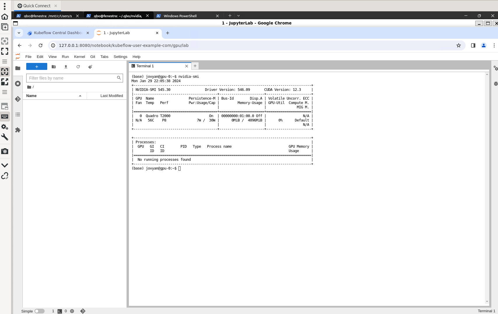
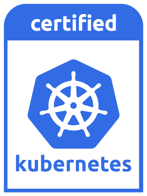

# Kubernetes Engine (QKE)

QKE is qbo's Kubernetes service. Kubernetes has emerged as the industry standard for modern cloud computing, yet its deployment and management complexities are well-known. Traditional approaches often rely on virtual machines, introducing performance challenges and unnecessary overhead.

Enter qbo—the solution that unleashes the true potential of cloud computing. With a single AsyncAPI across clouds and on-prem, qbo streamlines the deployment and management of cloud resources in Kubernetes, all while delivering unparalleled bare metal performance with Docker-in-Docker (DinD) deployments. This approach not only simplifies but also accelerates the adoption of modern cloud computing.

QBO is tailored for the demands of resource-intensive environments, making it an optimal choice for AI and ML workloads. Its commitment to optimized performance ensures that your cloud infrastructure meets the unique requirements of advanced computing applications. Embrace the future of cloud computing effortlessly with qbo.

> Watch the video

[](https://www.youtube.com/embed/s2pItFe8IwU?rel=0")


------------------------

## Quick Start

#### 1. Get version

```bash
qbo version | jq .version[]?
```
```json
{
  "qbo_cli": "dev-4.3.0-6efb3214c"
}
{
  "docker_api": "1.41",
  "docker_version": "20.10.23",
  "qbo_api": "cloud-dev-4.3.0-76da24342",
  "host": "lux.cloud.qbo.io"
}
```

#### 2. Add cluster

```bash
export CLUSTER_NAME=alex
qbo add cluster $CLUSTER_NAME -i hub.docker.com/kindest/node:v1.27.3 | jq
```

#### 3. Get nodes

```bash
qbo get nodes $CLUSTER_NAME | jq .nodes[]?
```
```json
{
  "name": "control-2b4e4848.localhost",
  "id": "0c20025cd1947252881eaefbbb2ebbd31893c3263fd28826b766fc3ce4fecd7d",
  "image": "kindest/node:v1.28.0",
  "cluster": "alex",
  "state": "ready",
  "address": "172.18.0.3",
  "os": "Debian GNU/Linux 11 (bullseye)",
  "kernel": "6.4.4-200.fc38.x86_64",
  "user": "alex@qbo.io",
  "cluster_id": "0a3db628-d9d3-46a5-81d8-281e727d8e6c"
}
{
  "name": "node-69fad8d5.localhost",
  "id": "bce293a5bad56200f2c1574919b0a67ce9761e0ee3071dc7530c02fc12f3ae79",
  "image": "kindest/node:v1.28.0",
  "cluster": "alex",
  "state": "ready",
  "address": "172.18.0.4",
  "os": "Debian GNU/Linux 11 (bullseye)",
  "kernel": "6.4.4-200.fc38.x86_64",
  "user": "alex@qbo.io",
  "cluster_id": "0a3db628-d9d3-46a5-81d8-281e727d8e6c"
}
{
  "name": "node-c0dbf9c8.localhost",
  "id": "2b2c2e39140d1bc61577f16907c93f0703fcc45352433f18578701e3e4c3ec19",
  "image": "kindest/node:v1.28.0",
  "cluster": "alex",
  "state": "ready",
  "address": "172.18.0.5",
  "os": "Debian GNU/Linux 11 (bullseye)",
  "kernel": "6.4.4-200.fc38.x86_64",
  "user": "alex@qbo.io",
  "cluster_id": "0a3db628-d9d3-46a5-81d8-281e727d8e6c"
}
```

#### 4. Get kubeconfig 

```bash
qbo get cluster $CLUSTER_NAME -k | jq -r '.output[]?.kubeconfig | select( . != null)' > $HOME/.qbo/$CLUSTER_NAME.cfg
export KUBECONFIG=$HOME/.qbo/$CLUSTER_NAME.cfg
```

```bash
kubectl get nodes
```
```
NAME                         STATUS   ROLES           AGE   VERSION
control-2b4e4848.localhost   Ready    control-plane   17m   v1.28.0
node-69fad8d5.localhost      Ready    <none>          16m   v1.28.0
node-c0dbf9c8.localhost      Ready    <none>          16m   v1.28.0
```

-------------------

## Commands
|Command            | Argument                            | Options  | Paraemeter | Admin | Example                                                         |    Description               | CLOUD | CE |
|-------------------|-------------------------------------|----------|------------|-------|-----------------------------------------------------------------|------------------------------|-|-|
| qbo add cluster   |    char[64]                         | -i     |  char[64]    |  N    | qbo add cluster `alex` -i `hub.docker.com/kindest/node:v1.27.2` | Add cluster                  |X|X|
|                   |                                     | -n     |  unsigned    |  N    |                                                                 | Number of nodes              |X|X|
|                   |                                     | -d     |  char[128]   |  N    |                                                                 | Domain name                  |X|X|
| qbo add node      |    char[64] |          |                                    |  N    | qbo add node `alex`                                             | Add node to cluster          |X|X|
|                   |                                     | -n     | unsigned     |  N    | qbo add node `alex` -n `3`                                      | Add n nodes to cluster       |X|X|
| qbo add user      |    char[64] |          |                                    |  Y    | qbo add user `alex`                                             | Add user                     |X| | 
|                   |                                     | --admin|              |  Y    | qbo add user --admin `alex`                                     | Add admin user               |X| |
| qbo add network   |    char[64] |          |                                    |  Y    | qbo add net `136.25.15.102 136.25.15.103`                       | Add network                  |X| |
| qbo delete network|    char[64] |          |                                    |  Y    | qbo del net `136.25.15.102 136.25.15.103`                       | Delete network               |X| |
| qbo delete user   |    char[64] |          |                                    |  Y    | qbo del user `alex`                                             | Delete user                  |X| |
| qbo delete node   |    char[64] |          |                                    |  N    | qbo del node `node-2b251a2c`                                    | Delete node                  |X|X|
| qbo delete cluster|    char[64] |          |                                    |  N    | qbo delete cluster `alex`                                       | Delete cluster               |X|X|
|                   |                                     | -A     |              |  N    | qbo delete cluster -A                                           | Delete all clusters          |X|X|
| qbo stop node     |    char[64] |          |                                    |  N    | qbo stop node `node-2b251a2c.localhost`                         | Stop node                    |X|X|
| qbo stop cluster  |    char[64] |          |                                    |  N    | qbo stop cluster `alex`                                         | Stop cluster                 |X|X|      
|                   |                                     | -A     |              |  N    | qbo stop cluser -A                                              | Stop all clusters            |X|X|
| qbo start node    |    char[64] |          |                                    |  N    | qbo start node `node-2b251a2c`                                  | Start node                   |X|X|
|                   |                                     | -A     |              |  N    | qbo start node -A                                               | Start all nodes              |X|X|
| qbo start cluster |    char[64] |          |                                    |  N    | qbo start cluster `alex`                                        | Start cluster                |X|X|
|                   |                                     | -A     |              |  N    | qbo start cluster -A                                            | Start all clusters           |X|X|
| qbo get nodes     |    char[64] |          |                                    |  N    | qbo get nodes `alex`                                            | Get nodes                    |X|X|
|                   |                                     | -A     |              |  N    | qbo get nodes -A                                                | Get all nodes                |X|X|
|                   |                                     | -w     |              |  N    | qbo get nodes -w `43706dd0`                                     | Watch nodes                  |X| |
| qbo get pods      |    char[64] |          |                                    |  N    | qbo get pods `alex`                                             | Get pods                     |X|X|
|                   |                                     | -A     |              |  N    | qbo get pods -A                                                 | Get all pods                 |X|X|
|                   |                                     | -w     |              |  N    | qbo get pods -w `43706dd0`                                      | Watch pods                   |X| |
| qbo get services  |    char[64] |          |                                    |  N    | qbo get svc `alex`                                              | Get cluster services         |X| |
|                   |                                     | -A     |              |  N    | qbo get svc -A                                                  | Get all services             |X| |
|                   |                                     | -w     |              |  N    | qbo get svc -w `43706dd0`                                       | Watch services               |X| |
| qbo get ipvs      |    char[64] |          |                                    |  N    | qbo get ipvs `alex`                                             | Get cluster load balancers   |X| |
|                   |                                     | -A     |              |  N    | qbo get ipvs -A                                                 | Get all load balancers       |X| |
| qbo get images    |    char[64] |          |                                    |  N    | qbo get images                                                  | Get node images              |X|X|
|                   |                                     | -A     |              |  N    | qbo get images -A                                               | Get all images               |X|X|
| qbo get users     |    char[64] |          |                                    |  N    | qbo get user `alex`                                             | Get user                     |X| |
|                   |                                     | -A     |              |  N    | qbo get users -A                                                | Get all users                |X| |
| qbo get cluster   |    char[64] |          |                                    |  N    | qbo get cluster `alex`                                          | Get cluster                  |X| |
|                   |                                     | -A     |              |  N    | qbo get cluster -A                                              | Get all clusters             |X|X|
|                   |                                     | -k     |              |  N    | qbo get cluster -k `alex`                                       | Get cluster kubeconfig       |X| |
| qbo get network   |    char[64] |          |                                    |  N    | qbo get net `alex`                                              | Get cluster network          |X|X|
|                   |                                     | -A     |              |  N    | qbo get net -A                                                  | Get all cluster networks     |X|X|
|                   |                                     | -H     |              |  Y    | qbo get net -H                                                  | Get host network             |X| |
| qbo version       |    char[64] |          |                                    |  N    | qbo version                                                     | Get qbo version              |X| |


------------------------
## AI & ML
###  Nvidia GPU Operator

NVIDIA GPU Operator plays a crucial role in enabling organizations to harness the power of NVIDIA GPUs for AI and machine learning workloads in Kubernetes environments, leading to faster innovation, improved model performance, and greater efficiency in AI deployments.

QBO Kubernetes Engine (QKE) offers unparalleled performance for any ML and AI workloads, bypassing the constraints of traditional virtual machines. By deploying Kubernetes components using Docker-in-Docker technology, it grants direct access to hardware resources. This approach delivers the agility of the cloud while maintaining optimal performance.

?> [](https://youtu.be/nl7sWLsuDOI)

#### Prerequsites

<!-- * [CLI](cli.md) Configuration  -->
|   Dependency	        |      Validated or Included Version(s)     | Notes 
|-----------|----------| |
|[Kubernetes](https://kubernetes.io/docs/home/) | [v1.25.11](https://github.com/kubernetes/kubernetes/tree/release-1.25) | |
|[NVIDIA Container Toolkit](https://docs.nvidia.com/datacenter/cloud-native/container-toolkit/latest/install-guide.html)|   [v1.14.3](https://github.com/NVIDIA/nvidia-container-toolkit/releases/tag/v1.14.3)       ||
|[NVIDIA GPU Operator](https://docs.nvidia.com/datacenter/cloud-native/gpu-operator/latest/index.html) | [v23.9.1](https://github.com/NVIDIA/gpu-operator/releases/tag/v23.9.1) ||
|NVIDIA Driver   | [535.129.03](https://www.nvidia.com/download/driverResults.aspx/213194/en-us/) [546.01](https://www.nvidia.com/download/driverResults.aspx/216365/en-us/)||
|[NVIDIA CUDA](https://docs.nvidia.com/cuda/)| [12.2](https://developer.nvidia.com/cuda-12-2-0-download-archive)||
|OS | Linux, Windows 10, 11 (WSL2)| |

#### qbot
[1. Install qbot](qbot)

##### 2. Run qbot
```bash
./qbot gpu-operator
```


#### 1. Create K8s Cluster

> For this tutorial we are using `nvidia` as our cluster name
```bash
export NAME=nvidia  
```

> Get qbo version to make sure we have access to qbo API
```bash
qbo version | jq .version[]?
```

> Add a K8s cluster with image v1.25.11. See [Kubeflow compatibility](ai_and_ml?id=kubeflow)
```bash
qbo add cluster $NAME -i hub.docker.com/kindest/node:v1.25.11 | jq
```

> Get nodes information using qbo API

```bash
qbo get nodes $NAME | jq .nodes[]?
```

> Configure kubectl 
```bash
export KUBECONFIG=$HOME/.qbo/$NAME.cfg
```

> Get nodes with kubectl
```bash
kubectl get nodes
``` 


#### 2. Deploy Nvidia GPU Operatator
##### 2.1 Linux
> Nvidia GPU Operatator helm chart

```bash
helm repo add nvidia https://helm.ngc.nvidia.com/nvidia || true
helm repo update
helm install --wait --generate-name -n gpu-operator --create-namespace nvidia/gpu-operator --set driver.enabled=false

```

##### 2.2 Windows (WSL2)

##### 2.2.1 Add PCI Labels
```bash
for i in $(kubectl get no --selector '!node-role.kubernetes.io/control-plane' -o json | jq -r '.items[].metadata.name'); do
        kubectl label node $i feature.node.kubernetes.io/pci-10de.present=true
done
```

##### 2.2.2 Deploy Chart Templates
```bash
git clone https://github.com/alexeadem/qbot
cd qbot/gpu-operator
OUT=templates
kubectl apply -f $OUT/gpu-operator/crds.yaml
kubectl apply -f $OUT/gpu-operator/templates/
kubectl apply -f $OUT/gpu-operator/charts/node-feature-discovery/templates/
watch kubectl get pods

```


#### 3. Deploy Vector Add 
```
cat cuda/vectoradd.yaml
```

```yaml
apiVersion: v1
kind: Pod
metadata:
  name: cuda-vectoradd
spec:
  restartPolicy: OnFailure
  containers:
  - name: cuda-vectoradd
    image: "nvcr.io/nvidia/k8s/cuda-sample:vectoradd-cuda11.7.1-ubuntu20.04"
    resources:
      limits:
        nvidia.com/gpu: 1

```

```bash
kubectl apply -f cuda/vectoradd.yaml
```

#### 4. Get Vector Add Logs

```bash
kubectl logs cuda-vectoradd
```
```
[Vector addition of 50000 elements]
Copy input data from the host memory to the CUDA device
CUDA kernel launch with 196 blocks of 256 threads
Copy output data from the CUDA device to the host memory
Test PASSED
Done
```


### Kubeflow

Kubeflow plays a crucial role in democratizing AI by providing a unified platform that enables organizations to efficiently develop, deploy, and manage AI applications at scale.

QBO Kubernetes Engine (QKE) offers unparalleled performance for any ML and AI workloads, bypassing the constraints of traditional virtual machines. By deploying Kubernetes components using Docker-in-Docker technology, it grants direct access to hardware resources. This approach delivers the agility of the cloud while maintaining optimal performance.

?> [](https://youtu.be/nl7sWLsuDOI?si=yS2XJ47zwharaN2x)

> The following instructions use the upstream Kubeflow project with `platform-agnostic-multi-user-pns` pipelines.


#### Prerequisites
##### Kubeflow v1.7.0 with Nvidia GPU support

|   Dependency	        |      Validated or Included Version(s)     | Notes
|-----------|----------|---|
|[Kubernetes](https://github.com/kubernetes/kubernetes/tree/v1.25.11) | v1.25.11 | |
|[Kubeflow](https://www.kubeflow.org/docs/releases/kubeflow-1.7/)   | v1.7.0   | The autoscaling/v2beta2 API version of HorizontalPodAutoscaler is no longer served as of v1.26.Migrate manifests and API clients to use the autoscaling/v2 API version, available since v1.23. All existing persisted objects are accessible via the new API v1.25 [HorizontalPodAutoscaler not found on minikube when installing kubeflow](https://stackoverflow.com/questions/76502195/horizontalpodautoscaler-not-found-on-minikube-when-installing-kubeflow)|
|OS | Linux, Windows 10, 11 (WSL2)| |


##### Kubeflow v1.8.0 with Nvidia GPU support  


|   Dependency	        |      Validated or Included Version(s)     | Notes
|-----------|----------|---|
|[Kubernetes](https://github.com/kubernetes/kubernetes/tree/v1.25.11) | v1.25.11 | |
|[Kubeflow](https://www.kubeflow.org/docs/releases/kubeflow-1.8/)   | v1.8.0   | [GPU Vendor not available error #7273](https://github.com/kubeflow/kubeflow/issues/7273)|
|OS | Linux, Windows 10, 11 (WSL2)| |

#### qbot
##### [1. Install qbot](qbot)

##### 2. Run qbot
```bash
./qbot kubeflow help
Usage:
./qbot kubeflow {v1.7.0 | v1.8.0}
```

#### [1. Install Nvidia GPU Operator](ai_and_ml?id=nvidia-gpu-operator)

#### 2. Install Kubeflow
  
```bash
cd $HOME
git clone https://github.com/kubeflow/manifests.git
cd manifests/
```

```bash
export KUBEFLOW_VERSION=v1.7.0
```
> `export KUBEFLOW_VERSION=v1.8.0` for version v1.8.0

```bash
git checkout $KUBEFLOW_VERSION
curl -s "https://raw.githubusercontent.com/kubernetes-sigs/kustomize/master/hack/install_kustomize.sh"  | bash
while ! ./kustomize build example | kubectl apply -f -; do echo "Retrying to apply resources"; sleep 10; done
```

#### 3. Configure Kubeflow
##### 3.1 Patch Deployment for DinD
> Once this finishes we also need to patch the Kubeflow Pipelines service to not use Docker, otherwise our pipelines will get stuck and report Docker socket errors. This happens because despite us using Docker the Docker docket isn’t made available inside the kind cluster. So from Kubeflow’s perspective we are using containerd directly instead of Docker.
```bash
./kustomize build apps/pipeline/upstream/env/platform-agnostic-multi-user-pns | kubectl apply -f -
watch kubectl get pods -A
```

<!-- > Node port
> CORS issue
```
kubectl patch svc istio-ingressgateway --type='json' -p '[{"op":"replace","path":"/spec/type","value":"NodePort"}]' -n istio-system
``` -->

#### 4. Access Kubeflow UI
> Port forward
```bash
kubectl port-forward svc/istio-ingressgateway -n istio-system 8080:80

```
##### 4.1 Linux
> You can then open your browser and navigate to http://127.0.0.1:8080 and login with the default credentials 

##### 4.2 Windows (WSL2)

> Under Windows Subsystem for Linux (WSL) you can install Google Chrome to access the product page 
> 
```bash
wget -O $HOME/google-chrome-stable_current_amd64.deb https://dl.>google.com/linux/direct/google-chrome-stable_current_amd64.deb
sudo apt install $HOME/google-chrome-stable_current_amd64.deb
```

```
wsl.exe -e google-chrome http://127.0.0.1:8080
```

##### 4.3 Login
> Default Credentials
> 
> username: `user@example.com`
> 
> password: `12341234`


<!--  -->

#### Related Content

[Unlocking AI & ML Metal Performance with QBO Kubernetes Engine (QKE) Part I - Deploying Nvidia GPU Operator](https://www.qbo.io/#/blog_part_1_nvidia_gpu_operator)

[Unlocking AI & ML Metal Performance with QBO Kubernetes Engine (QKE) Part II - Deploying Kubeflowr](https://www.qbo.io/#/blog_part_2_kubeflow)

[Running Kubeflow inside Kind with GPU support](https://jacobtomlinson.dev/posts/2022/running-kubeflow-inside-kind-with-gpu-support/)

------------------------
<!-- ## Ingress Controlller -->
## Network

### Nginx Ingress Controller
#### Coffee & Tea Demo

#### Prerequisites

In this demo we'll deploy a sample coffee & tea application with kubernetes ingress controller in qbo.

|   Dependency	        |      Validated or Included Version(s)     | Notes
|-----------|----------|---|
|[kubernetes ingress controller](https://github.com/kubernetes/ingress-nginx)| [v1.9.5](https://github.com/kubernetes/ingress-nginx/blob/controller-v1.9.5/deploy/static/provider/cloud/deploy.yaml)|[Supported Versions table](https://github.com/kubernetes/ingress-nginx?tab=readme-ov-file#supported-versions-table)|
|kubernetes | v1.27.3||


https://github.com/kubernetes/ingress-nginx?tab=readme-ov-file#supported-versions-table

#### qbot
##### [1. Install qbot](qbot)

##### 2. Run qbot
```bash
./qbot nginx
```

#### [1. Add cluster](cluster_ops)

#### 2. Deploy the ingress controller 

```bash
/usr/bin/kubectl apply -f https://raw.githubusercontent.com/kubernetes/ingress-nginx/controller-v1.9.5/deploy/static/provider/cloud/deploy.yaml
```

#### 3. Deploy Coffee & Tea Sample App
```bash
/usr/bin/kubectl apply -f /home/alex/qbo-demo/coffee/ingress-nginx/cafe
```

#### 4. Access Coffee & Tea App
##### 4.1 Patch service
> Set [externalTrafficPolicy](https://kubernetes.io/docs/tasks/access-application-cluster/create-external-load-balancer/#preserving-the-client-source-ip) to `Cluster`

```bash
 kubectl patch svc  ingress-nginx-controller -p '{"spec":{"externalTrafficPolicy":"Cluster"}}' -n ingress-nginx
 kubectl patch svc ingress-nginx-controller --type='json' -p '[{"op":"replace","path":"/spec/type","value":"NodePort"}]' -n ingress-nginx
```
##### 4.2 Get Coffee & Tea App Endpoint

##### 4.2.1 Linux
```bash
NODEPORT=$(kubectl get svc -n ingress-nginx -o json | jq -r '.items[].spec.ports[]? | select( .port == 443) | select(.nodePort) | .nodePort')
NODELST=$(kubectl get nodes -o json | jq '.items[].status.addresses[] | select(.type=="InternalIP") | .address' | tr -d '\"' | tr '\n' ' ')
```

##### 4.2.2 Windows (WSL2)
```bash
kubectl patch svc ingress-nginx-controller --type='json' -p '[{"op":"replace","path":"/spec/type","value":"ClusterIP"}]' -n ingress-nginx
kubectl port-forward svc/ingress-nginx-controller -n ingress-nginx 9443:443
```

##### 4.3 Test Coffee & Tea App
> If the response code `200` the deployment was successful.

##### 4.3 Linux
```bash
for i in $NODELST; do
        curl -kv -H 'host: cafe.example.com' https://$i:$NODEPORT/coffee
done
```

##### 4.3.2 Windows (WSL2)
```bash
curl -k -m 3 --write-out '%{http_code}' --silent --output /dev/null -H 'host: cafe.example.com'  https://localhost:9443/tea
```


------------------------

<!-- ## Service Mesh -->

### Istio 

#### Bookstore Demo

#### Prerequisites

In this demo we'll deploy a bookstore application with Istio in qbo.


|   Dependency	        |      Validated or Included Version(s)     | Notes
|-----------|----------|---|
|[istio](https://istio.io/latest/docs/setup/getting-started/) | 1.20.2|[Support status of Istio releases](https://istio.io/latest/docs/releases/supported-releases/#support-status-of-istio-releases)|
|kubernetes | v1.27.3||

#### qbot
##### [1. Install qbot](qbot)

##### 2. Run qbot
```bash
./qbot istio
```


#### [1. Add cluster](cluster_ops)

#### 2. Download Istio
```bash
cd ~
```
```bash
curl -L https://istio.io/downloadIstio | sh -
```
```bash
cd $(ls -dt ~/istio* | head -1)
```

#### 3. Install Istio
```bash
ISTIOCTL=$PWD/bin/istioctl
$ISTIOCTL install --set profile=demo -y --set meshConfig.defaultConfig.tracing.zipkin.address=splunk-otel-collector.istio-system.svc.cluster.local:9411
```
```bash
kubectl label namespace default istio-injection=enabled
```
#### 4. Deploy Bookstore Sample App
```bash
kubectl apply -f samples/bookinfo/platform/kube/bookinfo.yaml
```

#### 5. Acesss Bookstore
##### 5.1 Deploy Istio gateway 
```bash
kubectl apply -f samples/bookinfo/networking/bookinfo-gateway.yaml
```

##### 5.2 Get External Adress

###### 5.2.3 Linux
```bash
NODEPORT=$(kubectl get svc -n istio-system -o json | jq -r '.items[].spec.ports[]? | select( .port == 80) | select(.nodePort) | .nodePort')
NODELST=$(kubectl get nodes -o json | jq '.items[].status.addresses[] | select(.type=="InternalIP") | .address' | tr -d '\"' | tr '\n' ' ')

for i in $NODELST; do

        echo "http://$i:$NODEPORT/productpage"

done
```

###### 5.2.4 Windows (WSL2)

```bash
kubectl patch svc istio-ingressgateway --type='json' -p '[{"op":"replace","path":"/spec/type","value":"ClusterIP"}]' -n istio-system
kubectl port-forward svc/istio-ingressgateway -n istio-system 8080:80
echo "http://localhost:8080/productpage"
```

> Under Windows Subsystem for Linux (WSL) you can install Google Chrome to access the product page 
> 
```bash
wget -O $HOME/google-chrome-stable_current_amd64.deb https://dl.>google.com/linux/direct/google-chrome-stable_current_amd64.deb
sudo apt install $HOME/google-chrome-stable_current_amd64.deb
```

```
wsl.exe -e google-chrome http://localhost:8080/productpage
```

----------------

## Persistent Storage

### Local Path Provisioner
#### Let's Encrypt Certs Persistent Storage Demo

> Persistent volume example

```yaml
---
apiVersion: apps/v1
kind: Deployment
metadata:
  name: locus-ws
spec:
  replicas: 1
  selector:
    matchLabels:
      app: locus-ws
  template:
    metadata:
      labels:
        app: locus-ws
    spec:
      containers:
      - name: locus-ws
        image: registry.eadem.com/alex/locus-cloud/locus-ws:latest
        # command: ["/usr/bin/ws", "-l", "info"]
        volumeMounts:
        - name: etc-ws
          mountPath: "/etc/ws/"
          # subPath: "api.json"
          readOnly: true
        - name: volume
          mountPath: /tmp/locus/acme
        ports:
        - containerPort: 80
          name: http
        - containerPort: 443
          name: https
      imagePullSecrets:
        - name: regcred
      dnsConfig:
        options:
          - name: ndots
            value: "1"
      volumes:
      - name: etc-ws
        configMap:
          name: locus-ws-cm
      - name: volume
        persistentVolumeClaim:
          claimName: locus-ws-pvc

```

```yaml
---
apiVersion: v1
kind: PersistentVolumeClaim
metadata:
  name: locus-ws-pvc
  labels:
    # insert any desired labels to identify your claim
    app: locus-ws-pvc
spec:
  storageClassName: standard
  accessModes:
    - ReadWriteOnce
  resources:
    requests:
      # The amount of the volume's storage to request
      storage: 2Gi
```

--------------

# CNCF Conformance

QBO Kubernetes aligns with the Cloud Native Computing Foundation (CNCF) standards, ensuring adherence to best practices in cloud-native computing. This conformance establishes a solid foundation for scalability, interoperability, and performance, making qbo Kubernetes a reliable choice for AI workloads.


[](https://www.cncf.io/training/certification/software-conformance/)


## Sonobuoy

This portion provides guidance on conducting CNCF [conformance](https://www.cncf.io/certification/software-conformance/) tests for the qbo application. The testing process utilizes a diagnostic tool named [sonobuoy](https://github.com/vmware-tanzu/sonobuoy).


|   Dependency	        |      Validated or Included Version(s)     | Notes 
|-|-|-|
|qbo|ce|
|kubernetes|v1.30.0-alpha.0.102_41890534532931 v1.29.0 v1.28.0 v1.27.3 v1.27.2 v1.27.1 v1.27.0 v1.26.6 v1.26.4 v1.26.3 v1.26.2 v1.26.0 v1.25.9 v1.25.8 v1.25.3 v1.25.11 v1.24.15 v1.24.13 v1.24.12 v1.23.17 v1.23.13 v1.22.17 v1.21.14 v1.20.15 v1.19.16|

#### 1. Get Console Access
> To access the qbo web console, follow these steps:

Execute the following commands in your terminal
```bash
echo http://localhost:9601
```

Open your web browser and navigate to the address displayed in the output of the commands.

#### 2. Run Conformance Tests
---
> The execution of conformance tests involves running the `conformance` script, assisted by a typing bot named `qbot` that automates command input. Alternatively, you have the option to manually enter the commands in the shell.

The `conformance` script is designed to execute the following actions:

* Creation of a `qbo` cluster
* Configuration of `kubectl`
* Retrieval and setup of `sonobuoy`
* Execution of conformance tests on the specified version.

Usage:

```bash
./conformance help
>>> ./conformance help                 -- Show usage
>>> ./conformance list                 -- List available Kubernetes image tags
>>> ./conformance run {tag}            -- Run CNCF conformance results for qbo
```

List available Kubernetes tags:

```bash
./conformance list
```
Select version and run conformance test. Example: 
```bash
./conformance run v1.28.0
```
#### 3. Get Conformance Results
---
```bash
cat $HOME/sonobuoy/v1.28.0/qbo/e2e.log | grep Pass
```

#### References

> [CERTIFIED KUBERNETES SOFTWARE CONFORMANCE](https://www.cncf.io/certification/software-conformance/)
