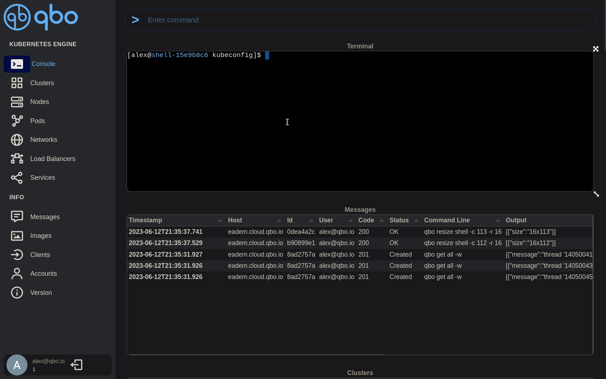

# Quick start

> Create a Kubernetes cluster with `qbo` and access it via kubectl
## Add cluster
> Type  your name in the autocomplete section and select the Kubernetes version


> Get `qbo` version
```bash
qbo version | jq .version[]?
```
> Get kubernetes nodes with `qbo` CLI

```bash
qbo get nodes $CLUSTER_NAME | jq .nodes[]?
```
## Access cluster
> Get kubeconfig with `qbo` CLI



```bash
qbo get cluster $CLUSTER_NAME -k | jq -r '.output[]?.kubeconfig | select( . != null)' > $HOME/.qbo/$CLUSTER_NAME.cfg
```
> export kubeconfig
```bash
export KUBECONFIG=$HOME/.qbo/$CLUSTER_NAME.cfg
```
> Get nodes with kubectl
```bash
kubectl get nodes
```
