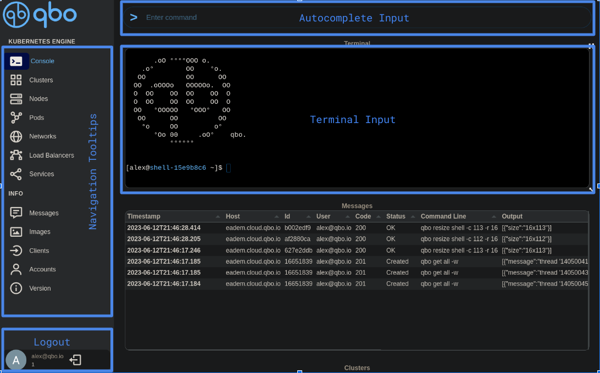

# Web interface

## Navigation

<!-- ## Autocomplete
## Console -->
# Cluster Operations
## Add Cluster
> Add cluster `alex`

## Stop cluster
> Stop cluster `alex`. All nodes in cluster `alex` will be stopped

## Start cluster
> Start cluster `alex`.

## Delete cluster
> Delete cluster `alex`. Cluster will be deleted. Operation is irreversible  

# Node Operations

## Stop Node
> Stops node with name `node-8a774663.localhost` `bfc61532`

## Start Node
> Starts node `bfc61532`

## Add Node
> Add new a new node to cluster `alex`

## Delete Node
> Scale cluster down by deleting node `node-8a774663.localhost`

